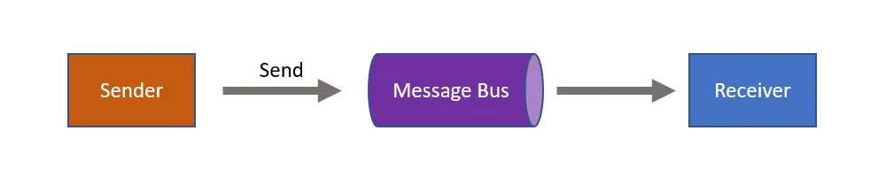

# kafka
## Table of content
- [Definition, purpose](#definition-purpose)
- [Comparison](#comparison-with-other-message-queue)
- [Producer / Consumer](#producer--consumer)

## Definition, purpose
Apache Kafka is a distributed streaming platform used designed to handle large volumes of real-time data. It’s an open-source system used for stream processing, real-time data pipelines and data integration. It was built on the concept of publish/subscribe model and provides high throughput, reliability and fault tolerance.

Kafka is built on 5 purposes:
- Real-time Data Pipelines
- Messaging Systems
- Stream Processing
- Event-driven Architecture
- Log Aggregation

## Comparison with other message queue
| Feature                     | Apache Kafka                                     | Redis Streams                                  | RabbitMQ                                        |
|----------------------------|--------------------------------------------------|------------------------------------------------|-------------------------------------------------|
| **Category** | Distributed event streaming platform | In-memory data structure with stream support  | Traditional message broker (AMQP-based) |
| **Persistence** | Durable log storage on disk | In-memory | Persistent queues supported (optional) |
| **Retention Model** | Time-based or size-based retention, configurable | Manual trimming required | Messages removed after acknowledgment |
| **Consumer Model** | Pull-based | Pull-based | Push/pull (configurable prefetching) |
| **Replay Support** | Yes (via offsets) | Yes (via stream IDs) | No (unless requeued manually) |
| **Scalability** | Partitioned, horizontal scaling | Scales with Redis Cluster | Clustering supported |
| **Latency** | Low | Very low (in-memory) | Low to medium |
| **Throughput** | Very high (millions of messages/sec) | High (memory-limited) | Medium |
| **Protocol** | Custom TCP | RESP (Redis protocol) | AMQP, MQTT, STOMP |
| **Message Ordering** | Per partition | Guaranteed by ID sequence | Queue-level FIFO |

## Producer / Consumer